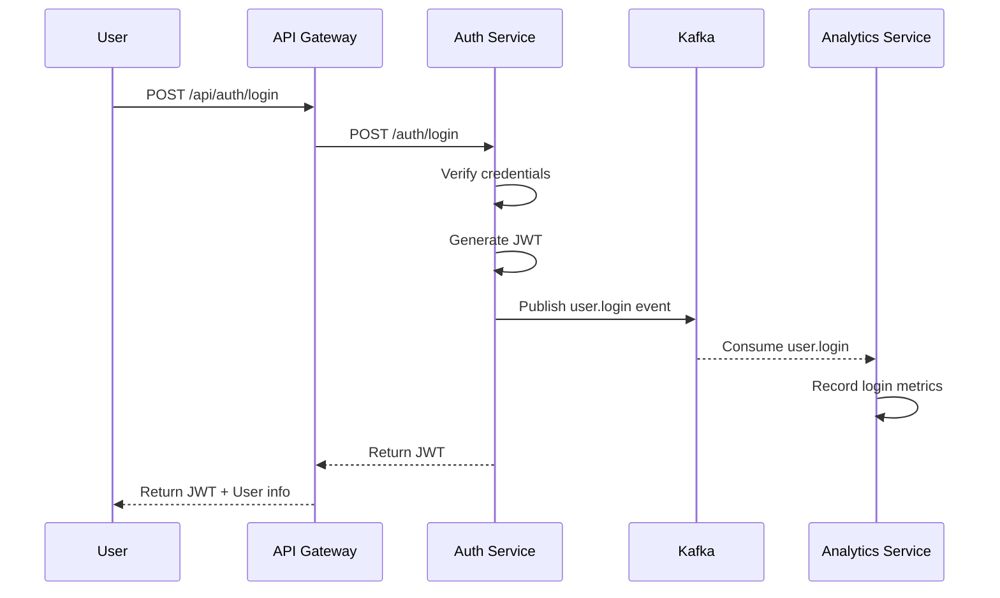
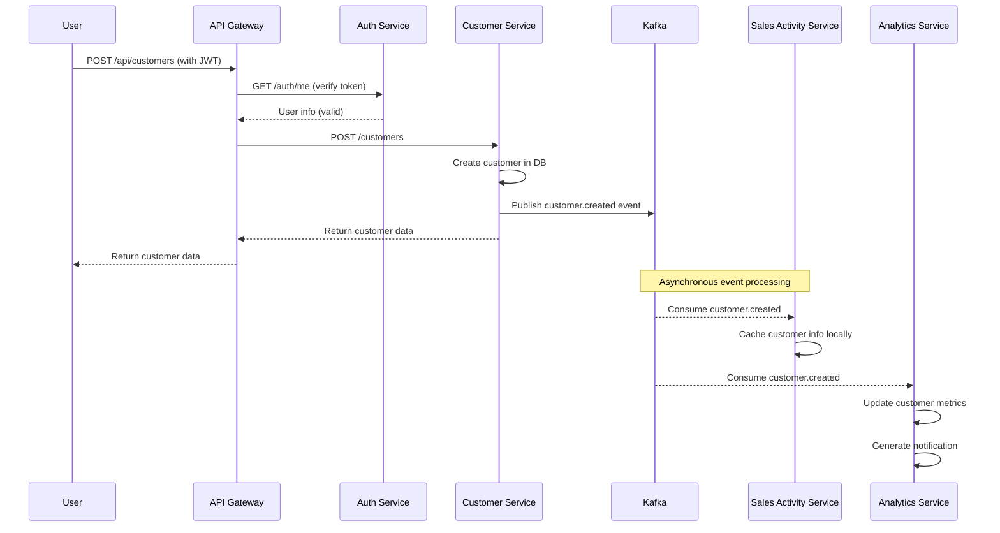
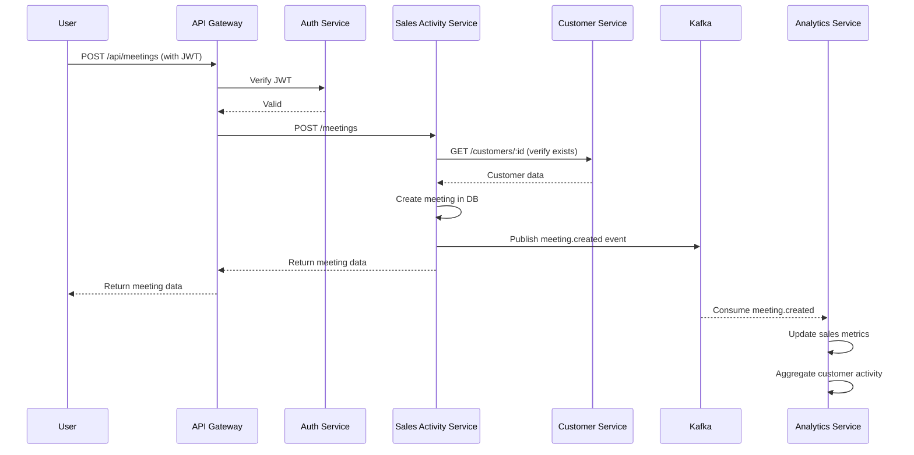
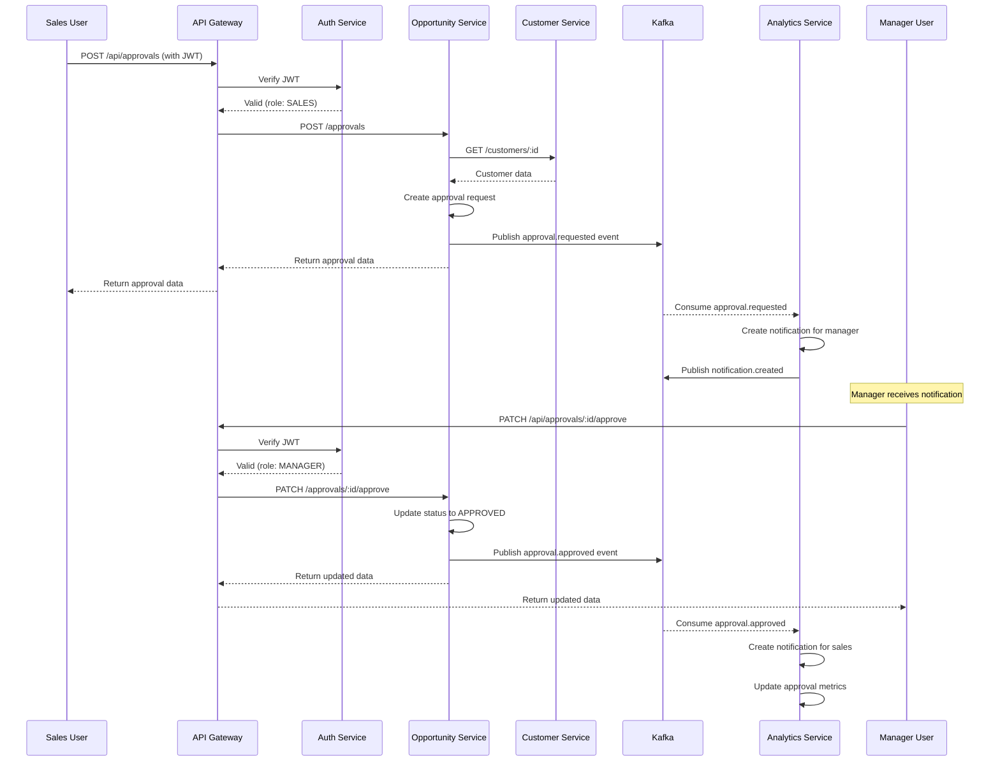
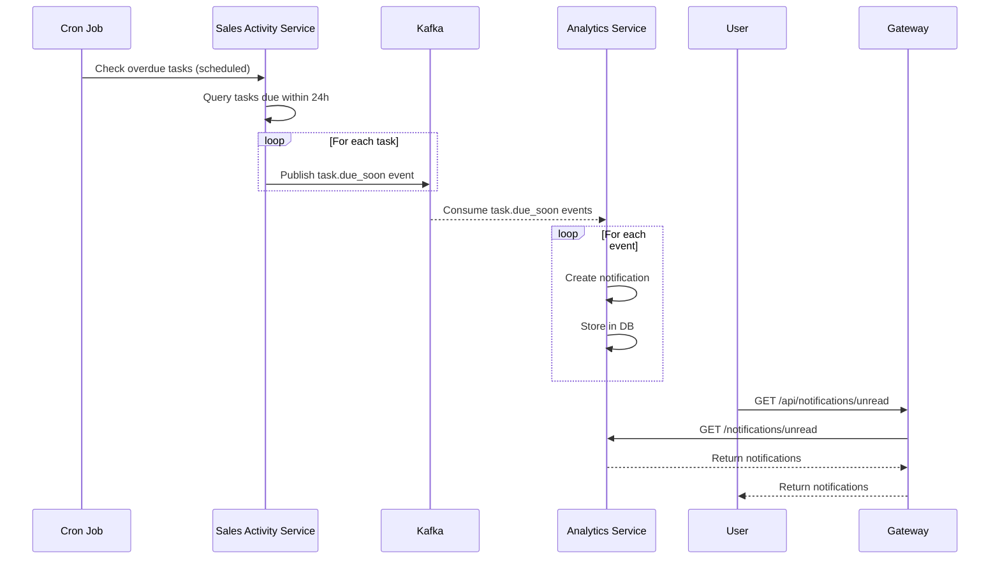
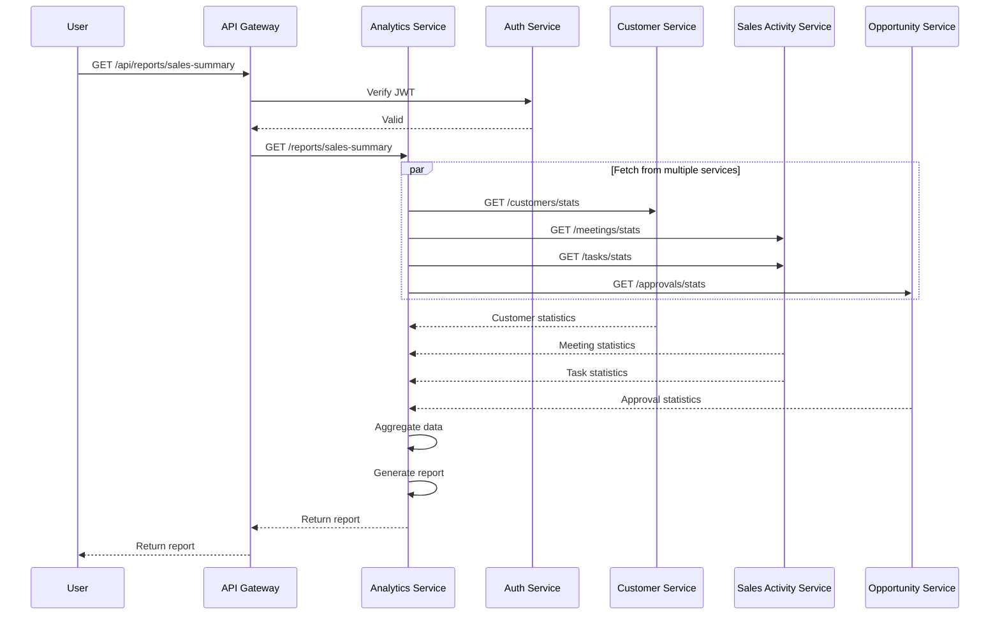
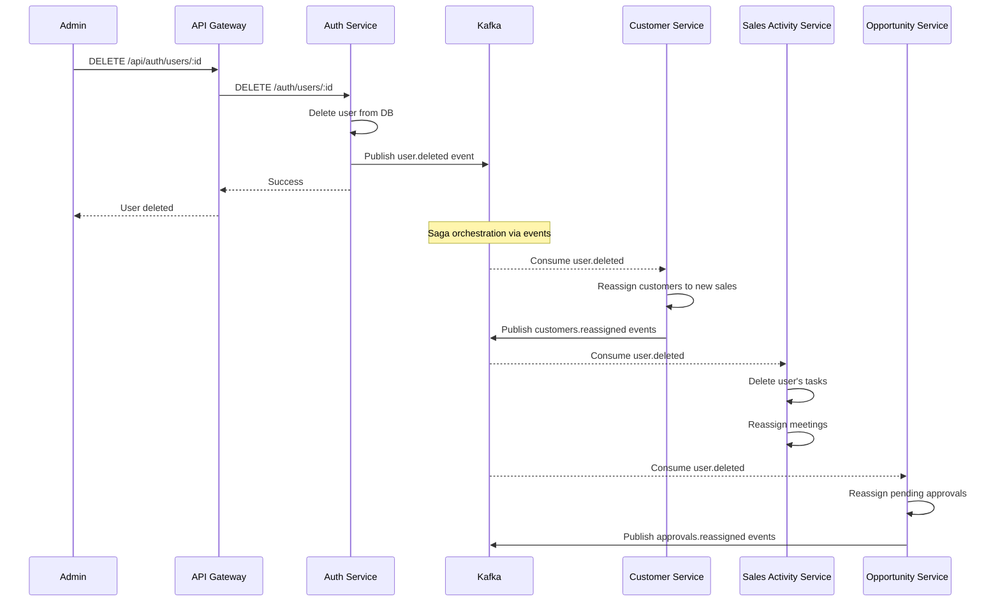
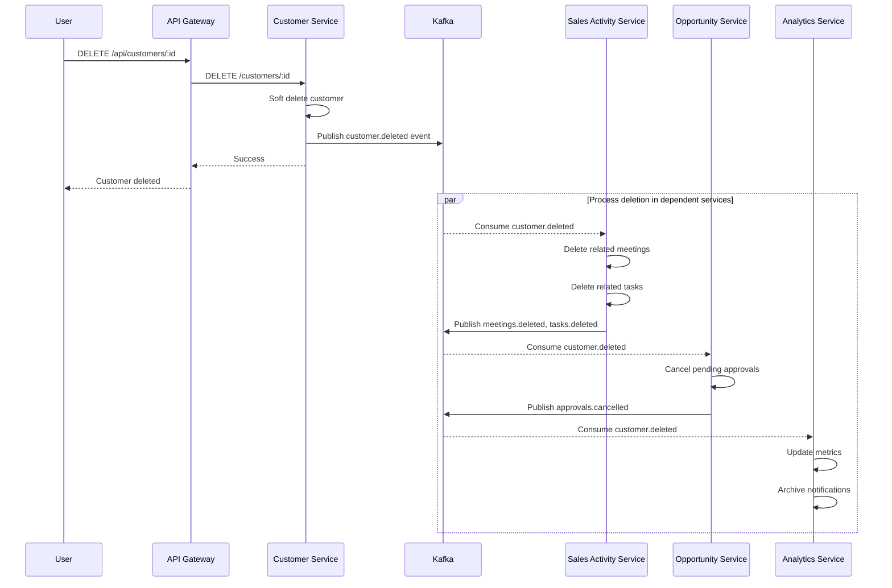

# サービス間通信シーケンス図

## 🔄 主要なユースケース

### 1. ユーザーログイン



**説明:**
1. ユーザーがログイン情報を送信
2. API Gatewayが Auth Service に転送
3. Auth Service が認証情報を検証し、JWTを発行
4. ログインイベントをKafkaに発行
5. Analytics Service がイベントを受信し、メトリクスを記録

---

### 2. 顧客作成 (イベント駆動)



**説明:**
1. ユーザーが顧客作成リクエスト (JWT付き)
2. API Gateway が JWT を Auth Service で検証
3. Customer Service が顧客をDBに作成
4. `customer.created` イベントをKafkaに発行
5. Sales Activity Service が非同期でイベントを受信し、顧客情報をキャッシュ
6. Analytics Service がイベントを受信し、メトリクスを更新

---

### 3. 商談記録の作成



**説明:**
1. ユーザーが商談記録を作成
2. Sales Activity Service が Customer Service に顧客存在確認 (同期)
3. 商談をDBに作成
4. `meeting.created` イベントをKafkaに発行
5. Analytics Service がイベントを受信し、メトリクスを更新

---

### 4. 承認申請フロー



**説明:**
1. 営業担当が承認申請を作成
2. Opportunity Service が顧客情報を確認 (同期)
3. 承認申請をDBに作成し、`approval.requested` イベントを発行
4. Analytics Service が通知を生成
5. マネージャーが承認操作
6. `approval.approved` イベントを発行
7. 営業担当に通知が生成される

---

### 5. タスク期限アラート (スケジュール実行)



**説明:**
1. Cron Job が Sales Activity Service の期限チェックをトリガー
2. 期限が近いタスクをクエリ
3. 各タスクについて `task.due_soon` イベントを発行
4. Analytics Service がイベントを受信し、通知を作成
5. ユーザーが通知を取得

---

### 6. レポート生成 (集約クエリ)



**説明:**
1. ユーザーがレポートをリクエスト
2. Analytics Service が複数のサービスから統計情報を並列取得
3. データを集約してレポートを生成
4. ユーザーにレポートを返却

---

### 7. ユーザー削除 (Saga パターン)



**説明:**
1. 管理者がユーザー削除をリクエスト
2. Auth Service がユーザーを削除し、`user.deleted` イベントを発行
3. 各サービスがイベントを受信し、関連データを処理 (Saga)
   - Customer Service: 顧客を別の営業に再アサイン
   - Sales Activity Service: タスク削除、商談再アサイン
   - Opportunity Service: 承認申請を再アサイン
4. 各サービスが処理完了イベントを発行

---

### 8. 顧客削除 (カスケード削除 with Saga)



**説明:**
1. ユーザーが顧客削除をリクエスト
2. Customer Service がソフト削除し、`customer.deleted` イベントを発行
3. 各サービスが並行してイベントを処理
   - Sales Activity Service: 関連商談・タスクを削除
   - Opportunity Service: 保留中の承認申請をキャンセル
   - Analytics Service: メトリクスを更新、通知をアーカイブ

---

## 🔑 通信パターンまとめ

### 同期通信 (REST API)

| パターン | 用途 | 例 |
|---------|------|-----|
| **Request-Response** | リアルタイムデータ取得 | 顧客情報照会、ログイン |
| **Service-to-Service** | データ整合性確認 | 商談作成時の顧客存在確認 |
| **Gateway Authentication** | トークン検証 | すべてのAPI呼び出し |

### 非同期通信 (Kafka Events)

| パターン | 用途 | 例 |
|---------|------|-----|
| **Event Notification** | 状態変化通知 | user.created, customer.updated |
| **Event-Carried State Transfer** | データ複製 | 顧客情報のキャッシング |
| **Event Sourcing** | イベント履歴保存 | 監査ログ、アクティビティトラッキング |
| **Saga Orchestration** | 分散トランザクション | ユーザー削除時の関連データ削除 |

---

## 🛡️ エラーハンドリング

### リトライポリシー

```typescript
// Kafka Consumer with retry
const consumer = kafka.consumer({
  groupId: 'customer-service-group',
  retry: {
    initialRetryTime: 100,
    retries: 8,
    maxRetryTime: 30000,
    multiplier: 2,
  },
});

// HTTP Client with retry
axios.get('/api/customers', {
  timeout: 5000,
  retry: 3,
  retryDelay: exponentialDelay,
});
```

### サーキットブレーカー

```typescript
import CircuitBreaker from 'opossum';

const breaker = new CircuitBreaker(customerServiceCall, {
  timeout: 3000,
  errorThresholdPercentage: 50,
  resetTimeout: 30000,
});

breaker.fallback(() => getCachedData());
```

---

## 📈 パフォーマンス最適化

1. **イベントバッチング**: 複数イベントをまとめて送信
2. **キャッシング**: Redis でホットデータをキャッシュ
3. **並列処理**: 複数サービスへの同時リクエスト
4. **非同期処理**: 重い処理はイベント駆動で実行

---

## 🧪 テスト戦略

### コントラクトテスト (Pact)

```typescript
// Consumer test (Customer MFE)
describe('Customer API contract', () => {
  it('should return customer list', async () => {
    await provider
      .addInteraction({
        state: 'customers exist',
        uponReceiving: 'a request for customers',
        withRequest: {
          method: 'GET',
          path: '/api/customers',
        },
        willRespondWith: {
          status: 200,
          body: like([{ id: '1', name: 'Test' }]),
        },
      })
      .executeTest(async (mockServer) => {
        const response = await getCustomers(mockServer.url);
        expect(response).toHaveLength(1);
      });
  });
});
```

### E2Eテスト (Playwright)

```typescript
test('should create customer and see in list', async ({ page }) => {
  await page.goto('/customers');
  await page.click('text=新規顧客追加');
  await page.fill('[name="name"]', 'Test Customer');
  await page.fill('[name="email"]', 'test@example.com');
  await page.click('text=作成');

  await expect(page.locator('text=Test Customer')).toBeVisible();
});
```
